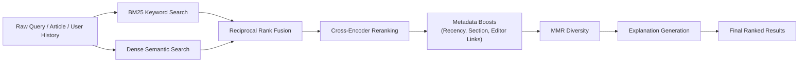
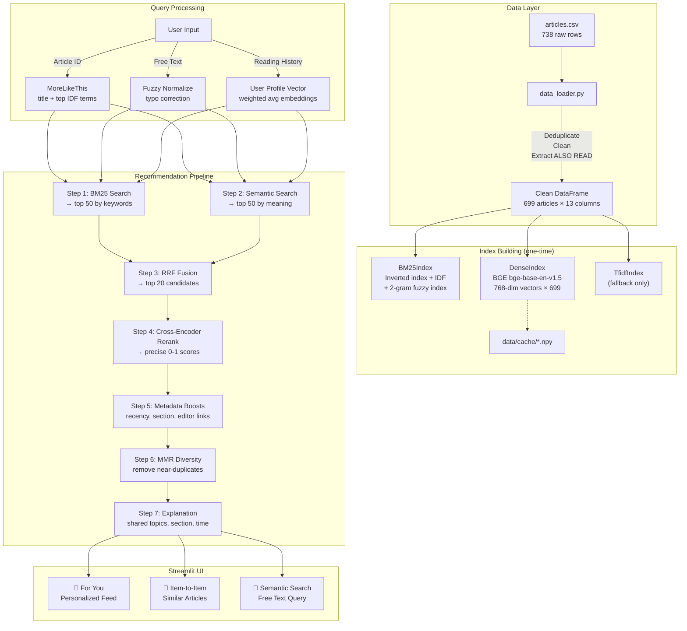

# 📰 Indian Express News Recommender System — Complete Project Documentation

> **Project Name:** `news_recommender`
> **Domain:** AI-Powered Content-Based News Recommendation
> **Tech Stack:** Python · Streamlit · Sentence-Transformers · Scikit-learn · Pandas · NumPy · PyTorch
> **Data Source:** Indian Express articles dataset (`articles.csv`, ~699 unique articles)

---

## Table of Contents

1. [Project Overview](#1-project-overview)
2. [Directory Structure](#2-directory-structure)
3. [Technology Stack & Dependencies](#3-technology-stack--dependencies)
4. [Configuration — `config.py`](#4-configuration--configpy)
5. [Data Loading & Cleaning — `src/data_loader.py`](#5-data-loading--cleaning--srcdataloaderpy)
6. [Retrieval Engines — `src/retrieval.py`](#6-retrieval-engines--srcretrievalpy)
7. [Cross-Encoder Reranker — `src/reranker.py`](#7-cross-encoder-reranker--srcrerankerpy)
8. [Recommender Pipeline — `src/recommender.py`](#8-recommender-pipeline--srcrecommenderpy)
9. [Streamlit Frontend — `app.py`](#9-streamlit-frontend--apppy)
10. [Exploratory Data Analysis — `eda.py`](#10-exploratory-data-analysis--edapy)
11. [Evaluation Harness — `evaluate.py`](#11-evaluation-harness--evaluatepy)
12. [Streamlit Theme Configuration — `.streamlit/config.toml`](#12-streamlit-theme-configuration--streamlitconfigtoml)
13. [Embedding Cache — `data/cache/`](#13-embedding-cache--datacache)
14. [End-to-End Data Flow & Pipeline Diagram](#14-end-to-end-data-flow--pipeline-diagram)
15. [How to Run the Project](#15-how-to-run-the-project)
16. [Tuning Guide](#16-tuning-guide)

---

## 1. Project Overview

This project is a **full-stack AI-powered news article recommendation system** built for **The Indian Express** newspaper. It enables three distinct recommendation modes:

| Mode | Description |
|---|---|
| **🎯 Personalized "For You" Feed** | Dynamically adapts to the user's session reading history using a weighted user profile vector |
| **📄 Item-to-Item Recommendations** | Given a selected article, finds the most related articles in the dataset |
| **🔎 AI Semantic Search** | Free-text search with typo correction, fuzzy matching, and conceptual understanding |

### Core Algorithmic Pipeline (6 Steps)



### Key Differentiating Features

- **Dual-mode operation**: Full neural mode (BAAI/bge-base-en-v1.5 + cross-encoder) or lightweight TF-IDF fallback — auto-switches if models fail to load
- **Fuzzy Indian-entity matching**: Handles typos like `akkhhlesh` → `akhilesh`, `virat koli` → `virat kohli`, including merged token correction (`akkh lesh` → `akhilesh`)
- **Editor-curated ground truth**: Extracts "ALSO READ" linked articles from raw body text as ground truth labels for evaluation
- **Calibrated recency decay**: Section-specific half-life curves (live blogs decay in 6 hours, sports in 1 day, business in 3 days)
- **Session-based personalization**: Exponentially-weighted user history profile vector blended with content similarity

---

## 2. Directory Structure

```
news_recommender/
├── .streamlit/
│   └── config.toml              # Streamlit dark theme configuration
├── data/
│   ├── articles.csv             # Raw dataset (~3.69 MB, 738 rows → 699 after dedup)
│   └── cache/
│       └── embeddings_*.npy     # Pre-computed embedding vectors (~2.1 MB each)
├── src/
│   ├── __init__.py              # Empty package marker
│   ├── data_loader.py           # CSV → clean DataFrame (154 lines)
│   ├── retrieval.py             # BM25, Dense, TF-IDF indexes + RRF fusion (296 lines)
│   ├── reranker.py              # Cross-encoder re-scoring (27 lines)
│   └── recommender.py           # Full pipeline orchestrator (338 lines)
├── app.py                       # Streamlit UI frontend (333 lines)
├── config.py                    # All tunable hyperparameters (66 lines)
├── eda.py                       # Exploratory Data Analysis script (94 lines)
├── evaluate.py                  # Evaluation & benchmarking (89 lines)
├── requirements.txt             # Python dependencies (5 packages)
├── README.md                    # Project README
└── venv/                        # Python virtual environment
```

**Total lines of application code: ~1,397 lines** (excluding README, requirements, config.toml)

---

## 3. Technology Stack & Dependencies

### [requirements.txt](file:///d:/indian%20express/Recommendation%20system/news_recommender/requirements.txt)

| Package | Purpose |
|---|---|
| `pandas` | DataFrame operations, CSV loading, data manipulation |
| `numpy` | Numerical array operations, vector math, cosine similarity |
| `scikit-learn` | TF-IDF vectorizer, English stop words list |
| `streamlit>=1.32` | Web application framework (requires v1.32+ for `st.status`) |
| `sentence-transformers` | HuggingFace models for neural embeddings and cross-encoder |

### Implicit Dependencies (installed by `sentence-transformers`)

| Package | Purpose |
|---|---|
| `torch` (PyTorch) | Neural network inference, GPU/CPU detection |
| `transformers` | HuggingFace model architecture |
| `huggingface-hub` | Model downloading and caching |

### Pre-trained Models Used

| Model | Type | Size | Purpose |
|---|---|---|---|
| `BAAI/bge-base-en-v1.5` | Bi-encoder | ~440 MB | Generates 768-dim article embedding vectors |
| `BAAI/bge-reranker-base` | Cross-encoder | ~1.1 GB | Pair-wise relevance scoring of (query, candidate) |

---

## 4. Configuration — [`config.py`](file:///d:/indian%20express/Recommendation%20system/news_recommender/config.py)

Every tunable parameter lives in this single file. The file is organized into 8 sections:

### 4.1 Paths & Environment (Lines 1–17)

```python
ROOT = Path(__file__).parent                          # Project root directory
DATA_PATH = ROOT / "data" / "articles.csv"            # Raw dataset location
CACHE_DIR = ROOT / "data" / "cache"                   # Embedding cache directory
```

- **`HF_TOKEN`** (Line 13): HuggingFace API token set as environment variable default for authenticated model downloads.
- **`HF_HUB_DISABLE_SYMLINKS_WARNING`** (Line 14): Suppresses HuggingFace symlink warnings on Windows.
- **`USE_NEURAL_MODELS`** (Line 17): Controlled by env var `NEWSREC_NEURAL`. Set to `"0"` to force lightweight TF-IDF mode without any downloads.

### 4.2 Model Names & Query Handling (Lines 18–22)

| Parameter | Value | Description |
|---|---|---|
| `EMBEDDING_MODEL` | `"BAAI/bge-base-en-v1.5"` | Sentence-transformer bi-encoder model name |
| `RERANKER_MODEL` | `"BAAI/bge-reranker-base"` | Cross-encoder reranker model name |
| `QUERY_PREFIX` | `"Represent this sentence for searching relevant passages: "` | BGE instruction prefix for short search queries |
| `SHORT_QUERY_WORDS` | `12` | Queries with fewer words than this get the prefix |

### 4.3 Text Truncation (Lines 24–27)

| Parameter | Value | Description |
|---|---|---|
| `BODY_WORDS_EMBED` | `350` | First N words of article body used for embedding generation |
| `BODY_WORDS_RERANK` | `150` | First N words sent to the cross-encoder reranker |
| `BOILERPLATE_MIN_DOCS` | `4` | A sentence appearing in ≥ N articles is treated as boilerplate and removed |

### 4.4 Retrieval Pipeline (Lines 29–33)

| Parameter | Value | Description |
|---|---|---|
| `N_RETRIEVE` | `50` | Top candidates retrieved from each search method (BM25 + semantic) |
| `N_CANDIDATES` | `20` | Candidates kept after RRF fusion, sent to the reranker |
| `RRF_K` | `60` | Reciprocal Rank Fusion constant (standard value) |
| `TOP_K` | `10` | Default number of final recommendations returned |

### 4.5 Diversity — MMR (Line 36)

| Parameter | Value | Description |
|---|---|---|
| `MMR_LAMBDA` | `0.75` | Maximal Marginal Relevance trade-off. `1.0` = pure relevance, lower = more variety |

### 4.6 Personalization (Lines 38–40)

| Parameter | Value | Description |
|---|---|---|
| `MAX_USER_HISTORY` | `10` | Track last N read articles for user profile |
| `USER_PROFILE_WEIGHT` | `0.35` | Blend weight for user history vector vs. content similarity |

### 4.7 Metadata Boosts (Lines 42–55)

| Parameter | Value | Description |
|---|---|---|
| `SECTION_BOOST_MULT` | `1.08` | 8% multiplicative boost for articles in the same section |
| `SUBSECTION_BOOST_MULT` | `1.05` | 5% multiplicative boost for same subsection |
| `RECENCY_MAX_BOOST_MULT` | `1.10` | Up to 10% boost for freshly published articles |

**Section-specific recency half-lives:**

| Section | Half-life | Rationale |
|---|---|---|
| `live_blog` | 0.25 days (6 hours) | Live events become stale very quickly |
| `sports` | 1.0 day | Sports results expire after a day |
| `entertainment` | 2.0 days | Entertainment news has moderate shelf life |
| `business` | 3.0 days | Business news remains relevant longer |
| `brand-story` | 4.0 days | Sponsored content stays relevant longest |
| `default` | 2.0 days | Fallback for unlisted sections |

### 4.8 Confidence Thresholds (Lines 57–64)

| Scoring Method | Threshold | Scale |
|---|---|---|
| `reranker` | `0.05` | Cross-encoder probability (0–1) |
| `dense` | `0.50` | Cosine similarity of BGE embeddings |
| `tfidf` | `0.08` | Cosine similarity of TF-IDF vectors |

> [!NOTE]
> If the best score in the result set falls below these thresholds, the UI displays a "no close match found" warning to avoid presenting weak results confidently.

---

## 5. Data Loading & Cleaning — [`src/data_loader.py`](file:///d:/indian%20express/Recommendation%20system/news_recommender/src/data_loader.py)

This module transforms the raw CSV into a clean, analysis-ready DataFrame. Every cleaning rule is derived from findings in `eda.py`.

### 5.1 Entry Point: [`load_articles()`](file:///d:/indian%20express/Recommendation%20system/news_recommender/src/data_loader.py#L106-L153)

**Input:** Path to `articles.csv` (738 raw rows)
**Output:** Clean `pd.DataFrame` with 699 rows and 13 columns

#### Cleaning Pipeline (in order):

| Step | Rule | Implementation |
|---|---|---|
| 1 | **Deduplicate** by `articleId` | `drop_duplicates(subset="articleId", keep="first")` — removes 39 duplicate rows |
| 2 | **Normalize Unicode** | [`normalise_text()`](file:///d:/indian%20express/Recommendation%20system/news_recommender/src/data_loader.py#L34-L38) — NFKC normalization, curly quotes → plain quotes, em/en dashes → hyphens, collapse whitespace |
| 3 | **Remove URLs & emails** | [`remove_links()`](file:///d:/indian%20express/Recommendation%20system/news_recommender/src/data_loader.py#L41-L42) — regex-based removal of `http://`, `www.`, and email addresses |
| 4 | **Extract & strip "ALSO READ"** | [`strip_also_read()`](file:///d:/indian%20express/Recommendation%20system/news_recommender/src/data_loader.py#L60-L76) — removes inline cross-references AND extracts linked article IDs for evaluation ground truth |
| 5 | **Remove boilerplate** | [`_find_boilerplate()`](file:///d:/indian%20express/Recommendation%20system/news_recommender/src/data_loader.py#L79-L84) + [`_strip_boilerplate()`](file:///d:/indian%20express/Recommendation%20system/news_recommender/src/data_loader.py#L87-L88) — sentences appearing in ≥4 articles are corpus-wide noise (disclaimers, quiz lines) |
| 6 | **Clip descriptions** | [`_short_description()`](file:///d:/indian%20express/Recommendation%20system/news_recommender/src/data_loader.py#L100-L103) — truncates descriptions longer than 300 characters at a word boundary |
| 7 | **Parse subsections** | [`_subsection()`](file:///d:/indian%20express/Recommendation%20system/news_recommender/src/data_loader.py#L91-L97) — JSON `'["Sports","Cricket"]'` → `"Cricket"` |

### 5.2 "ALSO READ" Extraction — How It Works

This is the most sophisticated cleaning step. Indian Express articles contain inline blocks like:

> *"ALSO READ: Akhilesh Yadav announces new alliance for UP elections 2027"*

These paste **unrelated headlines into the article body**, confusing search models. The system:

1. **Builds a headline index** ([`_headline_index()`](file:///d:/indian%20express/Recommendation%20system/news_recommender/src/data_loader.py#L50-L57)): Maps the first 4 lowercase alphanumeric words of every title → `(article_id, title_word_count)`
2. **Finds "ALSO READ" markers** using regex: `r"\balso\s+read\b[\s:|\\-\\u2013\\u2014]*"`
3. **Matches the following headline** to the index using the first 4 words
4. **Removes** the matched headline text from the body
5. **Records** the linked article ID → stored in `linked_ids` column for evaluation

### 5.3 Generated Text Columns

The loader creates three specialized text representations for each article:

| Column | Formula | Used By |
|---|---|---|
| `text_embed` | `"{title}. {description}. {first_350_body_words}"` | Dense embedding / TF-IDF vector generation |
| `text_bm25` | `"{title}. {title}. {title}. {description}. {body}"` | BM25 keyword search (title repeated 3× for boosted weight) |
| `text_rerank` | `"{title}. {description}. {first_150_body_words}"` | Cross-encoder reranker input |

### 5.4 Output DataFrame Schema

| Column | Type | Description |
|---|---|---|
| `id` | int | Unique article ID (`articleId`) |
| `title` | str | Cleaned article title |
| `description` | str | Cleaned, clipped description |
| `section` | str | Primary section (e.g., "India", "Sports", "Entertainment") |
| `subsection` | str | Sub-category (e.g., "Cricket", "Bollywood") — empty if none |
| `date` | datetime (UTC) | Publication date/time |
| `url` | str | Full article URL on indianexpress.com |
| `image` | str | Featured image URL |
| `is_live` | bool | Whether this is a live blog |
| `body` | str | Cleaned full article body |
| `linked_ids` | list[int] | Article IDs extracted from "ALSO READ" blocks |
| `text_embed` | str | Concatenated text for embedding |
| `text_bm25` | str | Title-boosted text for BM25 |
| `text_rerank` | str | Shorter text for cross-encoder |

### 5.5 Helper Functions Detail

| Function | Lines | Purpose |
|---|---|---|
| [`first_words(text, n)`](file:///d:/indian%20express/Recommendation%20system/news_recommender/src/data_loader.py#L30-L31) | 30–31 | Returns the first N whitespace-delimited words |
| [`normalise_text(text)`](file:///d:/indian%20express/Recommendation%20system/news_recommender/src/data_loader.py#L34-L38) | 34–38 | Unicode NFKC, smart-quote replacement, whitespace collapse |
| [`remove_links(text)`](file:///d:/indian%20express/Recommendation%20system/news_recommender/src/data_loader.py#L41-L42) | 41–42 | Strips URLs and email addresses |
| [`_word(token)`](file:///d:/indian%20express/Recommendation%20system/news_recommender/src/data_loader.py#L45-L47) | 45–47 | Lowercase alphanumeric-only form of a word for comparison |
| [`_headline_index(titles, ids)`](file:///d:/indian%20express/Recommendation%20system/news_recommender/src/data_loader.py#L50-L57) | 50–57 | Builds lookup: first-4-words-tuple → (article_id, word_count) |
| [`strip_also_read(body, own_id, headlines)`](file:///d:/indian%20express/Recommendation%20system/news_recommender/src/data_loader.py#L60-L76) | 60–76 | Removes "ALSO READ" blocks, extracts linked IDs |
| [`_find_boilerplate(bodies)`](file:///d:/indian%20express/Recommendation%20system/news_recommender/src/data_loader.py#L79-L84) | 79–84 | Finds sentences repeated in ≥ `BOILERPLATE_MIN_DOCS` articles |
| [`_strip_boilerplate(body, boilerplate)`](file:///d:/indian%20express/Recommendation%20system/news_recommender/src/data_loader.py#L87-L88) | 87–88 | Removes boilerplate sentences from a single article |
| [`_subsection(value)`](file:///d:/indian%20express/Recommendation%20system/news_recommender/src/data_loader.py#L91-L97) | 91–97 | Parses JSON section2Name array to extract subsection |
| [`_short_description(text, limit)`](file:///d:/indian%20express/Recommendation%20system/news_recommender/src/data_loader.py#L100-L103) | 100–103 | Truncates at word boundary if > 300 chars |

---

## 6. Retrieval Engines — [`src/retrieval.py`](file:///d:/indian%20express/Recommendation%20system/news_recommender/src/retrieval.py)

This module implements three search indexes and a fusion mechanism. The system uses **two searches in parallel** (BM25 for exact keywords + semantic for meaning) and fuses them.

### 6.1 Shared Utilities

#### [`tokenize(text)`](file:///d:/indian%20express/Recommendation%20system/news_recommender/src/retrieval.py#L38-L45) (Lines 38–45)
- Lowercases text, extracts alphanumeric tokens via regex `[a-z0-9]+`
- Drops tokens shorter than 2 characters
- Drops English stop words (from scikit-learn's `ENGLISH_STOP_WORDS`)
- **Does NOT perform stemming** — intentional design choice to preserve Indian names (e.g., "Yadav" would be damaged by naive `s`-stripping)

#### [`_normalize_repeats(w)`](file:///d:/indian%20express/Recommendation%20system/news_recommender/src/retrieval.py#L48-L50) (Lines 48–50)
- Compresses repeated characters: `akkhhlesh` → `akhlesh`, `modiii` → `modi`
- Uses regex: `r"(.)\1+"` → `r"\1"`

#### Device Detection (Lines 24–28)
- Automatically uses CUDA GPU if available
- On CPU, sets `torch.set_num_threads()` to use all available cores

---

### 6.2 [`BM25Index`](file:///d:/indian%20express/Recommendation%20system/news_recommender/src/retrieval.py#L54-L197) — Keyword Search Engine

**BM25 (Best Matching 25)** is the standard keyword retrieval algorithm used in search engines like Elasticsearch.

#### Constructor: [`__init__(self, texts, k1=1.5, b=0.75)`](file:///d:/indian%20express/Recommendation%20system/news_recommender/src/retrieval.py#L69-L94)

| Internal Structure | Type | Description |
|---|---|---|
| `self.docs` | `list[list[str]]` | Tokenized version of every article |
| `self.lengths` | `np.ndarray` | Document lengths (in tokens) |
| `self.avg_len` | `float` | Average document length |
| `self.postings` | `dict[str, list[tuple]]` | Inverted index: word → [(position, term_frequency), ...] |
| `self.idf` | `dict[str, float]` | Inverse Document Frequency: `log(1 + (N - df + 0.5) / (df + 0.5))` |
| `self._vocab` | `set[str]` | All unique vocabulary terms |
| `self._ngram_to_vocab` | `dict[str, set]` | Character 2-gram → vocabulary words index (for fast fuzzy candidate retrieval) |

**BM25 Scoring Formula (per term per document):**
```
score = IDF(term) × (TF × (k1 + 1)) / (TF + k1 × (1 - b + b × docLen / avgLen))
```
Where `k1 = 1.5` (term frequency saturation) and `b = 0.75` (length normalization).

#### Fuzzy Entity Matching System

This is one of the most technically sophisticated parts of the project. It handles Indian name typos and transliteration variants:

##### [`find_best_vocab_match(token, cutoff=0.70)`](file:///d:/indian%20express/Recommendation%20system/news_recommender/src/retrieval.py#L96-L128)

**Algorithm:**
1. **Exact match check** — if token is in vocabulary, return immediately (ratio = 1.0)
2. **Repeat normalization** — `akkhhlesh` → `akhlesh`, check again (ratio = 0.95)
3. **2-gram candidate filtering** — pad token with `#`, extract character bigrams, use the pre-built ngram index to find candidates within ±3 character length
4. **SequenceMatcher scoring** — compute `difflib.SequenceMatcher` ratio against both the original token and the repeat-normalized form, take the max
5. **Tie-breaking** — among candidates with similar ratios (within 0.03), prefer the one appearing in more documents (higher IDF coverage)

> [!TIP]
> The 2-gram index makes fuzzy matching fast — instead of comparing against all ~30k+ vocabulary terms, it narrows candidates to ~60 using shared character bigrams.

##### [`normalize_query(query)`](file:///d:/indian%20express/Recommendation%20system/news_recommender/src/retrieval.py#L130-L177)

**Returns a 3-tuple:**
1. `clean_query` — rewritten string with typos corrected (used for Dense Embeddings & Reranker)
2. `corrections` — list of `(original, corrected)` pairs for UI display
3. `expanded_terms` — list of `(vocab_term, weight)` for BM25 scoring

**Merged-token correction** (Lines 148–159): If two adjacent tokens are unknown, the system tries merging them (e.g., `akkh` + `lesh` → `akhilesh`) with a higher cutoff of 0.80.

**Fuzzy weight**: Corrected terms receive a weight of `FUZZY_WEIGHT × ratio = 0.85 × ratio` instead of 1.0, to slightly down-weight uncertain corrections.

##### [`scores(query)`](file:///d:/indian%20express/Recommendation%20system/news_recommender/src/retrieval.py#L179-L188) & [`query_expand(query)`](file:///d:/indian%20express/Recommendation%20system/news_recommender/src/retrieval.py#L190-L196)

- `scores()` — returns a NumPy array of BM25 scores for all articles, using fuzzy-expanded terms
- `query_expand()` — returns human-readable correction strings for the UI

---

### 6.3 [`DenseIndex`](file:///d:/indian%20express/Recommendation%20system/news_recommender/src/retrieval.py#L202-L252) — Neural Semantic Search

Uses **BAAI/bge-base-en-v1.5** to generate 768-dimensional normalized embedding vectors. Similar meaning = close vectors (high cosine similarity).

#### Embedding Cache System ([`_load_or_build()`](file:///d:/indian%20express/Recommendation%20system/news_recommender/src/retrieval.py#L213-L229))

- **Cache key**: MD5 hash of `"{model_name}|{csv_mtime}|{num_articles}"` — first 12 hex characters
- **Cache location**: `data/cache/embeddings_{hash}.npy`
- **Cache invalidation**: Automatically invalidated when the source CSV file modification time changes
- **Batch encoding**: 64 articles per batch, with progress bar
- **Normalization**: All vectors are L2-normalized at encoding time (so dot product = cosine similarity)

#### Methods

| Method | Input | Output | Description |
|---|---|---|---|
| [`scores_for_text(text, short)`](file:///d:/indian%20express/Recommendation%20system/news_recommender/src/retrieval.py#L232-L236) | text query | scores array | Encodes query, computes cosine sim with all articles. Adds `QUERY_PREFIX` for short queries (BGE model requirement) |
| [`scores_for_doc(pos)`](file:///d:/indian%20express/Recommendation%20system/news_recommender/src/retrieval.py#L238-L239) | article position | scores array | Article-to-article cosine similarity |
| [`get_vector(pos)`](file:///d:/indian%20express/Recommendation%20system/news_recommender/src/retrieval.py#L241-L242) | article position | 768-dim vector | Returns raw embedding vector |
| [`scores_for_vector(vec)`](file:///d:/indian%20express/Recommendation%20system/news_recommender/src/retrieval.py#L244-L248) | arbitrary vector | scores array | Scores against a pre-computed vector (used for user profile) |
| [`similarity_matrix(positions)`](file:///d:/indian%20express/Recommendation%20system/news_recommender/src/retrieval.py#L250-L252) | list of positions | NxN matrix | Pairwise similarity among selected articles (used for MMR diversity) |

---

### 6.4 [`TfidfIndex`](file:///d:/indian%20express/Recommendation%20system/news_recommender/src/retrieval.py#L256-L280) — Lightweight Fallback

Used when neural models are unavailable (env var `NEWSREC_NEURAL=0` or download failure).

- **Vectorizer**: scikit-learn `TfidfVectorizer` with English stop words, unigrams + bigrams (`ngram_range=(1, 2)`), and sublinear TF (`log(1 + TF)`)
- **Same API** as `DenseIndex` — the `Recommender` class doesn't need to know which one is active
- **`name` attribute**: `"tfidf"` (vs `"dense"` for DenseIndex) — used to select the right confidence threshold

---

### 6.5 [`reciprocal_rank_fusion(rankings, k=60)`](file:///d:/indian%20express/Recommendation%20system/news_recommender/src/retrieval.py#L285-L295) — Rank Fusion

Merges multiple ranked lists without needing comparable scores:

```
score(article) = Σ (1 / (k + rank_in_list))
```

- An article ranked #1 in any list gets `1/(60+1) = 0.0164` points from that list
- An article ranked high in **both** BM25 and semantic search gets the most points
- The constant `k=60` is the standard value from the original RRF paper (Cormack et al., 2009)

---

## 7. Cross-Encoder Reranker — [`src/reranker.py`](file:///d:/indian%20express/Recommendation%20system/news_recommender/src/reranker.py)

### How It Differs from the Retrieval Step

| | Retrieval (Step 1–2) | Reranking (Step 3) |
|---|---|---|
| Speed | Fast (dot product) | Slow (full transformer forward pass) |
| Input | Query and documents encoded separately | Query and document read together |
| Accuracy | Good | Much better |
| Scale | All 699 articles | Only top 20 candidates |

### [`Reranker`](file:///d:/indian%20express/Recommendation%20system/news_recommender/src/reranker.py#L14-L26) Class

- **Model**: `BAAI/bge-reranker-base` loaded as a `CrossEncoder` from sentence-transformers
- **Max sequence length**: 512 tokens (covers title + description + ~150 body words)
- **Scoring**: Raw logits → sigmoid → probability (0–1)

```python
def score(self, query, documents):
    pairs = [(query, doc) for doc in documents]
    logits = self.model.predict(pairs, activation_fn=self._identity)
    return 1.0 / (1.0 + np.exp(-logits))   # sigmoid
```

> [!NOTE]
> The `nn.Identity()` is passed as `activation_fn` to get raw logits from the model, then sigmoid is applied manually. This is because the bge-reranker-base model outputs unbounded logits.

---

## 8. Recommender Pipeline — [`src/recommender.py`](file:///d:/indian%20express/Recommendation%20system/news_recommender/src/recommender.py)

This is the **orchestrator** that ties everything together. It contains the full recommendation pipeline, personalization logic, boosting, diversity, and explanation generation.

### 8.1 Data Classes

#### [`Recommendation`](file:///d:/indian%20express/Recommendation%20system/news_recommender/src/recommender.py#L26-L30)

| Field | Type | Description |
|---|---|---|
| `article` | `dict` | Article data (id, title, snippet, section, date, url, image, is_live) |
| `score` | `float` | 0–1 relevance score displayed to the user |
| `reason` | `str` | Human-readable "why recommended" explanation |

#### [`Result`](file:///d:/indian%20express/Recommendation%20system/news_recommender/src/recommender.py#L33-L39)

| Field | Type | Description |
|---|---|---|
| `recommendations` | `list[Recommendation]` | Ordered list of recommended articles |
| `low_confidence` | `bool` | True if no article in dataset matches well |
| `best_relevance` | `float` | Highest relevance score among candidates |
| `method` | `str` | Actual method used (may differ from requested if reranker unavailable) |
| `notes` | `list[str]` | Informational messages (corrections, warnings) |

### 8.2 [`Recommender`](file:///d:/indian%20express/Recommendation%20system/news_recommender/src/recommender.py#L42-L337) Class

#### Constructor ([`__init__`](file:///d:/indian%20express/Recommendation%20system/news_recommender/src/recommender.py#L43-L50))

1. Stores the article DataFrame and builds `id_to_pos` mapping
2. Creates `BM25Index` from `text_bm25` column
3. Tries to build `DenseIndex` (neural); falls back to `TfidfIndex` on failure
4. Tries to build `Reranker` (cross-encoder); sets to `None` on failure
5. Records any failure notes for sidebar display

#### Available Methods (Line 23)

```python
METHODS = ["bm25", "semantic", "hybrid", "hybrid+rerank"]
```

### 8.3 Core Method: [`recommend()`](file:///d:/indian%20express/Recommendation%20system/news_recommender/src/recommender.py#L79-L206)

**Signature:**
```python
def recommend(self, query=None, article_id=None, user_history=None,
              top_k=10, method="hybrid+rerank", use_boosts=True,
              diversify=True, section=None) -> Result
```

**Three input modes** (mutually selectable):
1. `article_id` → Item-to-item recommendation
2. `query` → Free-text semantic search
3. `user_history` → Personalized "For You" feed

#### Step 0: Query Preparation (Lines 87–119)

**For article_id input:**
- Extracts the article's position in the DataFrame
- Builds a "MoreLikeThis" focused query: title tokens + top 15 IDF body terms
- Gets semantic scores via `scores_for_doc()`
- Gets BM25 scores by searching the focused text

**For text query input:**
- Runs `bm25.normalize_query()` for fuzzy correction
- Detects if query is "short" (< 12 words) to apply BGE query prefix
- Gets semantic scores via `scores_for_text()`
- Records corrections as UI notes

**For user_history input:**
- Builds user profile vector via `_build_user_profile_vector()`
- Gets semantic scores by comparing profile vector against all articles
- Sets BM25 scores to zero (no keyword matching for profile-based)

#### Step 1–2: Search & Fusion (Lines 121–144)

1. **Block articles** that shouldn't be recommended:
   - The input article itself (for item-to-item)
   - Recently read articles from user history
   - Articles not matching the section filter
2. **Retrieve** top-50 from BM25 and top-50 from semantic search
3. **Fuse** using RRF (or use single method if `bm25`/`semantic` selected)
4. **Keep** top-20 candidates for reranking

#### Step 3: Relevance Scoring (Lines 146–176)

**For `hybrid+rerank`:**
- Text queries: uses **query-centered passage extraction** ([`_extract_query_passage()`](file:///d:/indian%20express/Recommendation%20system/news_recommender/src/recommender.py#L209-L236)) to find the most relevant window in long articles
- Article queries: uses the standard `text_rerank` column
- **Blends reranker + BM25**: `0.65 × reranker + 0.35 × normalized_BM25` for text queries (ensures entity presence is honored)

**For `bm25` only:**
- Normalizes BM25 scores to 0–1 by dividing by max

**For `semantic` or `hybrid` (no rerank):**
- Uses raw semantic similarity scores
- Applies corresponding confidence threshold

#### Step 4: Personalization & Boosts (Lines 178–189)

**User profile blending** (if both `user_vector` and `article_id` exist):
```python
final = (1 - USER_PROFILE_WEIGHT) × relevance + USER_PROFILE_WEIGHT × user_affinities
```

**Metadata boosts** ([`_boost_mult()`](file:///d:/indian%20express/Recommendation%20system/news_recommender/src/recommender.py#L266-L287)):

| Boost | Multiplier | Condition |
|---|---|---|
| Editor "ALSO READ" link | ×1.40 | Target article was linked by editor in source article |
| Same section | ×1.08 | Both articles in the same section |
| Same subsection | ×1.05 | Both articles in the same subsection |
| Recency | ×1.0 to ×1.10 | Exponential decay with section-specific half-life |

**Recency formula:**
```
recency_mult = 1.0 + (MAX_BOOST - 1.0) × 0.5^(days_old / half_life)
```

#### Step 5: MMR Diversity ([`_mmr()`](file:///d:/indian%20express/Recommendation%20system/news_recommender/src/recommender.py#L289-L306))

**Maximal Marginal Relevance** prevents near-duplicate results:

```
MMR_score(article) = λ × relevance - (1 - λ) × max_similarity_to_already_selected
```

**Key design decisions:**
- **Similarity threshold**: Only penalizes articles above 0.85 cosine similarity (search) or 0.80 (article-to-article) — avoids penalizing legitimately related but distinct articles
- **Lambda**: 0.88 for search (favor relevance), 0.75 for article recommendations (favor diversity)
- Uses `similarity_matrix()` to compute pairwise cosine similarity among candidates

#### Step 6: Explanation Generation ([`_explain()`](file:///d:/indian%20express/Recommendation%20system/news_recommender/src/recommender.py#L308-L326))

Builds a human-readable reason string combining:
- **Shared topics**: Top 4 IDF-weighted overlapping tokens between query and article
- **Same section**: If both articles share a section
- **Same time**: If published within 1 day of each other
- **User interest match**: If recommendation is personalized

Example: `"shared topics: akhilesh, yadav, elections; same section (India); published around the same time"`

### 8.4 User Profile Vector ([`_build_user_profile_vector()`](file:///d:/indian%20express/Recommendation%20system/news_recommender/src/recommender.py#L238-L257))

Computes a **weighted average** of the user's recent article embeddings:

```python
weight = 0.8 ^ rank   # exponential decay: most recent article = weight 1.0, second = 0.8, third = 0.64, ...
profile_vector = Σ (normalized_weight × article_embedding)
```

- Takes the last `MAX_USER_HISTORY = 10` articles
- More recent articles have exponentially higher influence
- The resulting vector is used for cosine similarity against all articles

### 8.5 Query-Centered Passage Extraction ([`_extract_query_passage()`](file:///d:/indian%20express/Recommendation%20system/news_recommender/src/recommender.py#L209-L236))

For text queries with the reranker, long article bodies need to be truncated to 512 tokens. Instead of always taking the lead, this method:

1. Finds the **first occurrence** of any query term (≥3 chars) in the article body
2. Centers a **160-word window** around that hit, biased towards the start (1/3 before, 2/3 after the hit)
3. Prepends title and description

This ensures the reranker sees the passage that actually contains the query-relevant mentions.

### 8.6 Helper: [`_to_dict(pos)`](file:///d:/indian%20express/Recommendation%20system/news_recommender/src/recommender.py#L328-L336)

Converts a DataFrame row at position `pos` into a plain dict for the UI:

```python
{
    "id": ..., "title": ..., "snippet": ..., "section": ...,
    "subsection": ..., "date": "06 Oct 2026", "url": ...,
    "image": ..., "is_live": True/False
}
```

---

## 9. Streamlit Frontend — [`app.py`](file:///d:/indian%20express/Recommendation%20system/news_recommender/app.py)

The UI is a **333-line Streamlit application** with zero search logic — all intelligence lives in the `src/` modules.

### 9.1 Page Configuration (Lines 10–15)

```python
st.set_page_config(
    page_title="Indian Express AI | News Recommender",
    page_icon="📰",
    layout="wide",
    initial_sidebar_state="expanded"
)
```

### 9.2 Custom CSS Injection (Lines 18–107)

The app injects a premium dark-mode CSS theme:

| CSS Class | Purpose |
|---|---|
| `.main-header` | Top banner with gradient background (`#0F141C → #1E293B`) and red left border |
| `.badge-live` | Red "LIVE" badge for live blog articles |
| `.badge-section` | Blue-bordered section/subsection label |
| `.badge-score` | Green gradient match score pill |
| `.article-card` | Dark card container with hover border animation |
| `.hero-card` | Larger gradient card for spotlight story |

**Typography**: Uses Google Fonts — `Outfit` (headers, 700 weight) and `Inter` (body, 300-600 weight).

### 9.3 Recommender Initialization (Lines 110–124)

```python
@st.cache_resource(show_spinner=False)
def get_recommender() -> Recommender:
```

- Uses Streamlit's `@st.cache_resource` to initialize the recommender **once** and persist across reruns
- Shows a `st.status()` widget with progress messages during first load
- Returns the `Recommender` instance that persists in Streamlit's resource cache

### 9.4 Session State Management (Lines 126–131)

| State Key | Type | Purpose |
|---|---|---|
| `user_history` | `list[int]` | List of article IDs the user has "read" this session |
| `_card_n` | `int` | Counter for generating unique Streamlit button keys |

### 9.5 Sidebar Controls (Lines 134–169)

| Control | Type | Default | Description |
|---|---|---|---|
| Indian Express logo | Image | — | Loaded from indianexpress.com CDN |
| Recommendations Count | Slider | `TOP_K` (10) | Range: 3–15 |
| Category Filter | Selectbox | "All" | Filters by section name |
| Reading History | Display | — | Shows last 5 read article titles |
| Clear History | Button | — | Resets `user_history` to empty list |
| Retrieval Method | Selectbox | `hybrid+rerank` | From `METHODS` list |
| Recency & Section Boosts | Checkbox | ✅ | Toggle metadata boosts |
| MMR Diversity | Checkbox | ✅ | Toggle diversity filtering |
| Show Images | Checkbox | ✅ | Toggle article image display |

### 9.6 Article Card Component ([`show_article_card()`](file:///d:/indian%20express/Recommendation%20system/news_recommender/app.py#L188-L236))

Renders a single article card with:
- **Image** (optional, left column — 1.2:3 ratio)
- **Badges**: section, subsection, LIVE indicator, match score
- **Title**: Clickable link to original article
- **Date**: Publication date
- **Snippet**: Article description or first 200 body characters
- **Reason**: "Why recommended" explanation (if available)
- **"Read Story" button**: Adds to user history and triggers rerun
- **"Full Article" link**: Direct link to indianexpress.com

### 9.7 Results Display ([`display_results()`](file:///d:/indian%20express/Recommendation%20system/news_recommender/app.py#L239-L253))

- Shows auto-correction messages (green success boxes)
- Shows informational notes (blue info boxes)
- Shows "no match" warning if `result.low_confidence` is True
- Iterates over recommendations and renders article cards

### 9.8 Featured Story (Lines 257–259)

Displays the most recent article (by date) in a collapsible expander with "TODAY'S SPOTLIGHT BREAKING STORY" label and hero card styling.

### 9.9 Three Navigation Tabs (Lines 262–332)

#### Tab 1: 🎯 For You (Personalized Feed)

- If user has reading history: calls `recommender.recommend(user_history=...)` and displays personalized results
- If no history: shows a welcome message and displays recent trending stories (sorted by date, top-K)

#### Tab 2: 📄 Item-to-Item Recommendations

- Dropdown with all articles (sorted by date, formatted as `"Title  (Section)"`)
- Displays the selected base article as a card
- Calls `recommender.recommend(article_id=...)` and shows related articles below

#### Tab 3: 🔎 AI Semantic Search

- **Quick-search buttons** (4 preset queries):
  - 🗳️ Akhilesh Yadav (UP)
  - 🏏 Virat Kohli (Cricket)
  - ⚖️ Supreme Court (SIR/EC)
  - 🥇 Asian Games Medals
- **Text input** with placeholder showing typo examples
- Calls `recommender.recommend(query=...)` and displays results

### 9.10 UI Helper: [`add_to_history()`](file:///d:/indian%20express/Recommendation%20system/news_recommender/app.py#L182-L185)

Adds an article ID to session history (avoiding duplicates) and shows a toast notification.

---

## 10. Exploratory Data Analysis — [`eda.py`](file:///d:/indian%20express/Recommendation%20system/news_recommender/eda.py)

A standalone script (`python eda.py`) that produces a console report. All findings from this EDA were used to design the cleaning rules in `data_loader.py`.

### Report Sections

| Section | What It Analyzes |
|---|---|
| **1. Dataset Overview** | Total rows, columns, duplicate count, unique count after dedup |
| **2. Missing Values** | Null counts for key columns: articleId, articleTitle, description, body_raw, sectionName, section2Name, postPublishDate, articleFeaturedImage |
| **3. Section Distribution** | Article count per section with percentages |
| **4. Text Noise** | URLs in body, emails in body, "ALSO READ" blocks, boilerplate sentence count with sample |
| **5. Description Anomalies** | Max/mean description length, count of descriptions > 300 chars |

### Key EDA Findings (that drove design decisions)

- **738 rows → 699 unique** articles (39 duplicates on `articleId`)
- **"ALSO READ" blocks** paste unrelated headlines into article bodies → must be removed
- **Boilerplate sentences** (disclaimers, quiz prompts) repeat across many articles → must be removed
- **Long descriptions** (>300 chars) exist in video articles → need clipping
- **URLs and emails** embedded in body text → need stripping

---

## 11. Evaluation Harness — [`evaluate.py`](file:///d:/indian%20express/Recommendation%20system/news_recommender/evaluate.py)

A standalone script (`python evaluate.py`) that benchmarks the four retrieval methods.

### Demo Queries (Lines 18–19)

```python
DEMO_QUERIES = ["flight crash", "actress Leony dies", "Ujjain mosque demolition",
                "Iran US war", "cricket world cup India", "health insurance claim"]
```

### Three Evaluation Parts

#### Part 1: [`demo(rec)`](file:///d:/indian%20express/Recommendation%20system/news_recommender/evaluate.py#L22-L29) — Qualitative Inspection

- Runs each demo query with `hybrid+rerank` method, `top_k=3`
- Prints top results with scores and titles
- Flags queries with no close match (e.g., "flight crash" — no such article in dataset)

#### Part 2: [`section_precision(rec, ids, method, k=5)`](file:///d:/indian%20express/Recommendation%20system/news_recommender/evaluate.py#L32-L39) — Same-Section Proxy Metric

- **Proxy metric**: For 60 randomly sampled articles, measures what fraction of top-5 recommendations share the same section
- **Rationale**: While not a perfect relevance metric, articles about cricket should mostly recommend other cricket articles
- Compares all 4 methods: bm25, semantic, hybrid, hybrid+rerank

#### Part 3: [`evaluate_linked_labels(rec, method)`](file:///d:/indian%20express/Recommendation%20system/news_recommender/evaluate.py#L42-L59) — Editor Ground Truth

Uses the "ALSO READ" linked article IDs extracted during cleaning as ground truth:

| Metric | Formula | Description |
|---|---|---|
| **Precision@5** | `relevant_in_top5 / 5` | Fraction of top-5 results that match editor choices |
| **nDCG@10** | `DCG / idealDCG` | Normalized Discounted Cumulative Gain at rank 10 |

```python
dcg = Σ (1 / log2(rank + 2))  for each relevant article in top-10
ideal = Σ (1 / log2(rank + 2))  for rank 0..min(num_relevant, 10)-1
```

#### Part 4: Optional Manual Labels

If `data/eval_labels.json` exists (format: `{"article_id": [relevant_id_1, relevant_id_2, ...]}`) it will be used for custom ground-truth evaluation.

---

## 12. Streamlit Theme Configuration — [`.streamlit/config.toml`](file:///d:/indian%20express/Recommendation%20system/news_recommender/.streamlit/config.toml)

```toml
[theme]
primaryColor = "#E50914"              # Indian Express red (Netflix-inspired accent)
backgroundColor = "#0F141C"           # Deep dark blue-black
secondaryBackgroundColor = "#1A212D"  # Slightly lighter dark blue
textColor = "#F1F5F9"                 # Near-white text (Slate-100)
font = "sans serif"                   # System sans-serif

[server]
headless = true                       # No browser auto-open

[runner]
magicEnabled = false                  # Disable Streamlit's magic (auto-display of expressions)
```

---

## 13. Embedding Cache — `data/cache/`

Contains pre-computed NumPy arrays of article embeddings:

| File | Size | Description |
|---|---|---|
| `embeddings_{hash}.npy` | ~2.1 MB each | 699 × 768 float32 matrix (699 articles × 768-dim BGE vectors) |

- **5 cache files present** — from different runs with different CSV modification times or model versions
- Each file represents a complete embedding of all articles with a specific model+data combination
- **Cache key format**: `embeddings_{md5(model|mtime|count)[:12]}.npy`

> [!IMPORTANT]
> The cache directory may accumulate old files. Only the one matching the current CSV's modification time is used. Old `.npy` files can be safely deleted.

---

## 14. End-to-End Data Flow & Pipeline Diagram



---

## 15. How to Run the Project

### Prerequisites
- Python 3.10+
- Internet connection (first run only, to download ~1.5 GB of models)

### Setup & Launch

```bash
cd "d:\indian express\Recommendation system\news_recommender"

# Create and activate virtual environment
python -m venv venv
# Windows:
venv\Scripts\activate
# Linux/Mac:
source venv/bin/activate

# Install dependencies
pip install -r requirements.txt

# Launch the application
streamlit run app.py
```

### First Run Behavior
1. Downloads `BAAI/bge-base-en-v1.5` (~440 MB) and `BAAI/bge-reranker-base` (~1.1 GB)
2. Embeds all 699 articles (~1 minute on CPU)
3. Saves embeddings to `data/cache/` — subsequent starts are instant

### Light Mode (No Downloads)

```powershell
# Windows PowerShell
$env:NEWSREC_NEURAL=0
streamlit run app.py
```

```bash
# Linux/Mac
NEWSREC_NEURAL=0 streamlit run app.py
```

Uses TF-IDF instead of neural embeddings. Lower quality but no internet or GPU required.

### Run EDA Report
```bash
python eda.py
```

### Run Evaluation Benchmark
```bash
python evaluate.py
```

---

## 16. Tuning Guide

| Symptom | Solution | Config Parameter |
|---|---|---|
| Too many "no match" warnings | Lower the threshold | `MIN_RELEVANCE["reranker"]`, `MIN_RELEVANCE["dense"]` |
| Too few "no match" warnings | Raise the threshold | Same as above |
| Results too similar to each other | Lower λ (e.g., 0.6) | `MMR_LAMBDA` |
| Want same-section articles ranked higher | Raise section boost | `SECTION_BOOST_MULT` |
| Fresh articles not ranked high enough | Raise recency boost | `RECENCY_MAX_BOOST_MULT` |
| Live blogs staying too long | Lower live_blog half-life | `SECTION_HALF_LIVES["live_blog"]` |
| User profile too dominant | Lower profile weight | `USER_PROFILE_WEIGHT` |
| Search too slow | Reduce candidate counts | `N_RETRIEVE`, `N_CANDIDATES` |
| Want more recommendations | Raise default top-K | `TOP_K` |
| Fuzzy matching too aggressive | Raise cutoff | `BM25Index.FUZZY_MIN_RATIO` |
| Fuzzy matching missing corrections | Lower cutoff | Same as above |

---

> [!TIP]
> **Recommended reading order** for understanding the codebase: [`config.py`](file:///d:/indian%20express/Recommendation%20system/news_recommender/config.py) → [`data_loader.py`](file:///d:/indian%20express/Recommendation%20system/news_recommender/src/data_loader.py) → [`retrieval.py`](file:///d:/indian%20express/Recommendation%20system/news_recommender/src/retrieval.py) → [`reranker.py`](file:///d:/indian%20express/Recommendation%20system/news_recommender/src/reranker.py) → [`recommender.py`](file:///d:/indian%20express/Recommendation%20system/news_recommender/src/recommender.py) → [`app.py`](file:///d:/indian%20express/Recommendation%20system/news_recommender/app.py)
